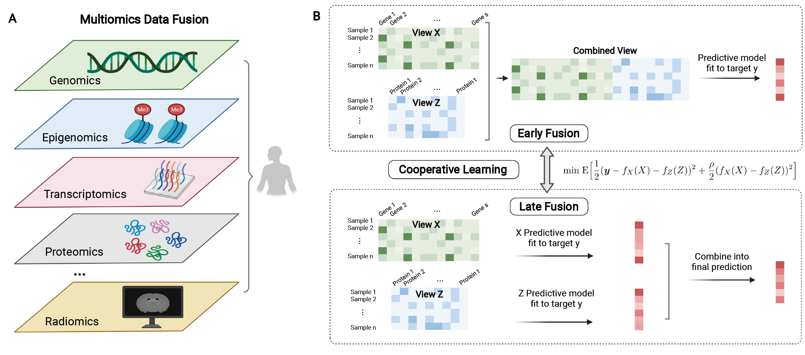

# Cooperative Learning for Multi-view Analysis

This repository hosts the code for <b>Cooperative Learning</b>, a supervised learning method for multiple sets of features ("views"), as described in ["Cooperative Learning for Multi-view Analysis"](https://arxiv.org/abs/2112.12337).

## About Cooperative Learning
* Cooperative learning combines the usual squared error loss of predictions with an <b>"agreement" penalty </b> to encourage the predictions from different data views to agree. 
* By varying the weight of the agreement penalty, we get <b>a continuum of solutions that include the well-known early and late fusion approaches</b>. Cooperative learning chooses the degree of agreement (or fusion) in an adaptive manner, using a validation set or cross-validation to estimate test set prediction error.
* One version of our fitting procedure is <b>modular</b>, where one can choose different fitting mechanisms (e.g. lasso, random forests, boosting, neural networks) appropriate for different data views. 
* In the setting of cooperative regularized linear regression, the method combines the lasso penalty with the agreement penalty, yielding <b>feature sparsity</b>.
* The method can be especially powerful when the different data views <b>share some underlying relationship</b> in their signals that can be exploited to strengthen signal, while each view has its idiosyncratic noise that needs to be reduced. Leveraging aligned signals and allowing flexible fitting mechanisms for different modalities, cooperative learning offers a powerful approach to <b>multiomics data fusion</b>. 
* Shown below is a visualization of the framework for multiomics data fusion. 
    * Panel A: Advances in biotechnologies have enabled the collection of <b>a myriad of ``-omics'' data</b> ranging from genomics to proteomics on <b>a common set of samples</b>. These data capture the molecular variations of human health at multiple levels and can help us understand complex biological systems in a more comprehensive way. Fusing the data offers the potential to improve predictive accuracy of disease phenotypes and treatment response, thus enabling better diagnostics and therapeutics.
    * Panel B: Commonly-used approaches to the problem can be broadly categorized into early and late fusion. Early fusion begins by transforming all datasets into a single representation, which is then used as the input to a supervised learning model of choice. Late fusion works by developing first-level models from individual data views and then combining the predictions by training a second-level model as the final predictor. Encompassing early and late fusion, cooperative learning combines the usual squared error loss of predictions with an agreement penalty term to encourage the predictions from different data views to align.

    
## Using Cooperative Learning
* The "cooperative_learning/" folder contains the implementation of cooperative learning. 
* The file "cooperative_learning_toy_example.R" gives a toy example on using the function of cooperative learning.
* The subfolder contains the code to reproduce the results of our simulation and real data example studies. 
  *  Specifically, the subfolder "regularized_cooperative_regression/" contains code for the simulation experiments based on the factor model that generates Figure 2A and Figure 3 in the paper and Figure S1-6 in SI appendix; the subfolder "solution_sparsity/" contains code for the simulation experiments for exploring solution sparsity and generates Figure 2B in the paper; the subfolder "general_cooperative_learning/" contains code for the simulation studies with more distinct data modalities (e.g. imaging and omics data), and corresponds to Figure 4 and Figure 5 in the paper; the subfolder "more_than_two_data_views/" contains code for the simulation experiments for more than 2 data views, which corresponds to Figure 7-8 in the SI appendix; at last, the subfolder "real_data_examples/" contains code for the real data experiments of labor onset prediction and breast ductal carcinoma in situ and invasive breast cancer classification, which corresponds to Table 1 and 2 in the paper.

## Reference 
Daisy Yi Ding, Shuangning Li, Balasubramanian Narasimhan, Robert Tibshirani. <b>Cooperative Learning for Multi-view Analysis</b>. 2022. [[arXiv](https://arxiv.org/abs/2112.12337)]
